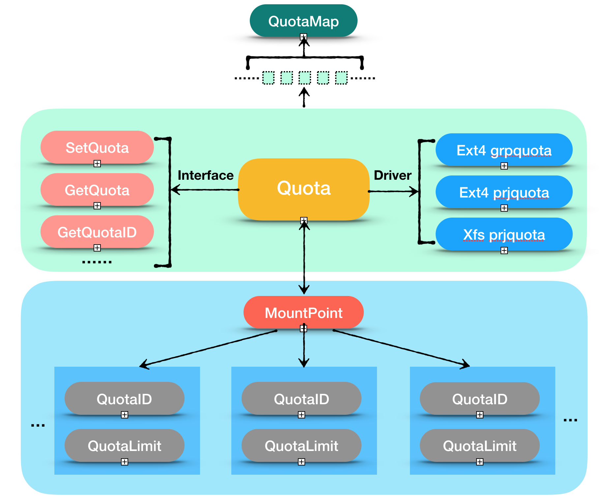

# Libquota

## Introduction
the library of disk quota

## upport kernel list

| | alikernel  | open kernel |
| --- | --- | --- |
| ext4 | >= 3.10 group quota   >= 4.5 project quota | >= 4.5 project quota |
| xfs | >= 3.10 project quota | >= 3.10 project quota|

## Architecture

